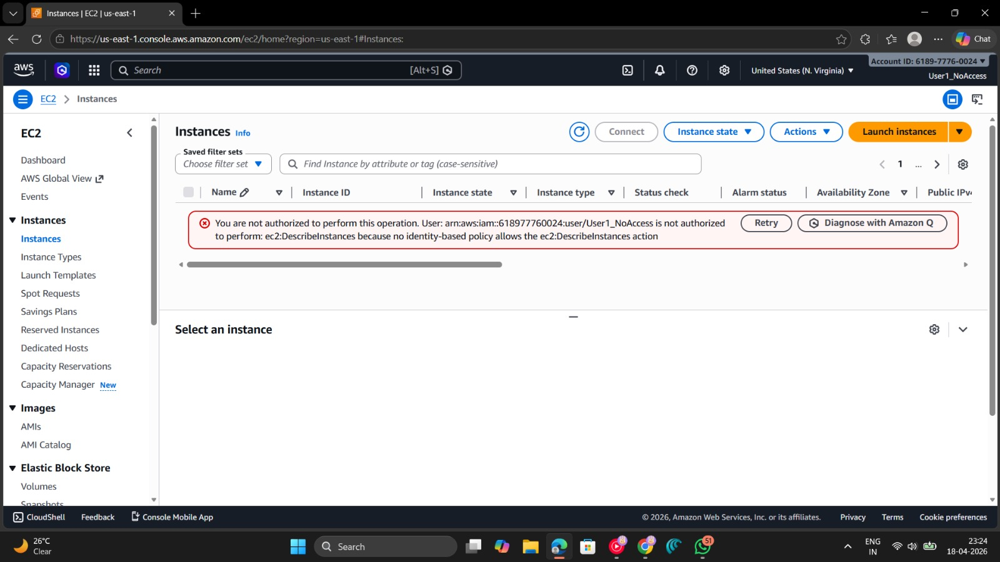
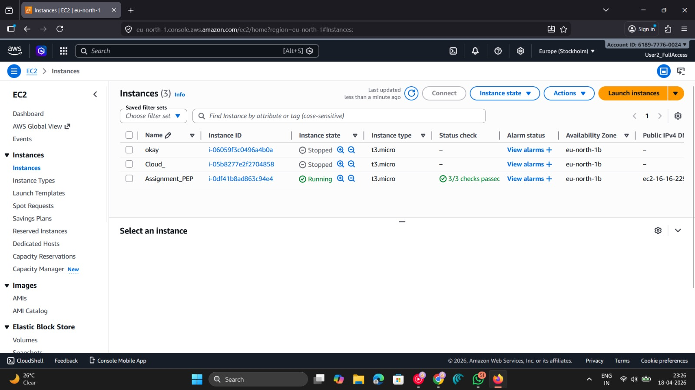

# ttt
Tic Tac Toe cloud
Elastic IP
[16.16.229.25](http://16.16.229.25)
EC2 Insance (Root User)
[Root user SS](Root_User_AWS_PEP.jpeg)

User 1 (No Access)

User 2 (All Access)

Challenges Faced
Forgot to setup apache2 server on my EC2 instance
Forgot to open port 80 in security group
Understood how IAM works and how users are created.
